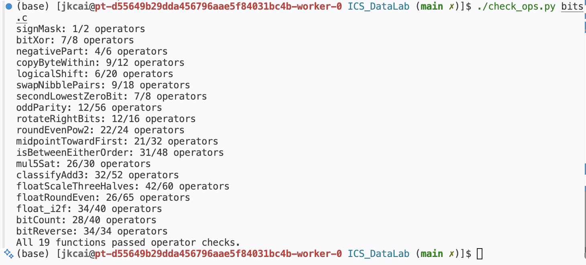
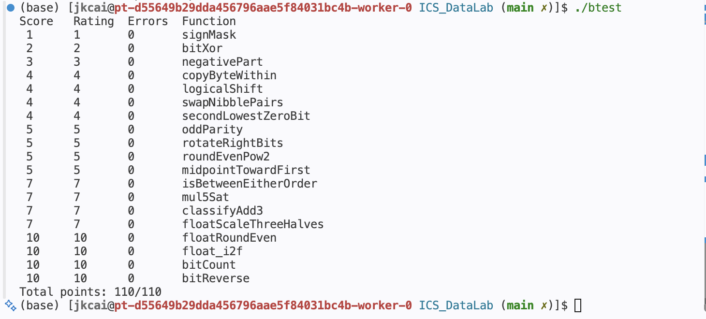

# Lab1 DataLab 实验报告

姓名：蔡纪坤  
学号：24300810016  

## 1. 总述

按照实验要求成功完成实验

## 2. 实验环境

- x86-64 Linux
- GCC
- 32 位编译环境（`gcc-multilib`、`libc6-dev-i386`）
- Python 3
- Git / GitHub

## 3. 各题实现思路

### P1 `signMask`

从常量 `1` 出发，将其左移 31 位，使唯一的 1 位移动到最高位，从而得到位模式 `0x80000000`。

### P2 `bitXor`

异或可以表示为“至少一个为 1，但不能同时为 1”。由于本题只允许 `~` 和 `&`，使用 De Morgan 定律将 OR/XOR 的逻辑改写为仅由取反和按位与构成的形式。

### P3 `negativePart`

首先通过算术右移 31 位得到符号掩码：负数得到全 1，非负数得到全 0。再利用补码取负公式 `~x + 1` 得到 `-x`，最后使用符号掩码选择负数结果；非负数会被掩码清零。

### P4 `copyByteWithin`

将 `src` 和 `dst` 左移 3 位得到对应字节的位偏移。先使用右移和 `0xFF` 提取源字节，再构造目标字节掩码将目标位置清零，最后把源字节移动到目标位置并与其余位合并。

### P5 `logicalShift`

C 中对有符号整数的右移为算术右移，因此负数会在高位补 1。本题先正常算术右移，再从最高位掩码构造出保留低 `32-n` 位的掩码，将符号扩展产生的高位 1 清除，从而模拟逻辑右移。该构造同时覆盖 `n=0` 和 `n=31`。

### P6 `swapNibblePairs`

构造 `0x0F0F0F0F` 掩码，分别提取每个字节的低 4 位和高 4 位。低 nibble 左移 4 位，高 nibble 右移 4 位并利用掩码清除算术右移带来的高位，最后将两部分合并。

### P7 `secondLowestZeroBit`

先对 `x` 取反，使原数中的 0 位转化为 1 位。利用 `y & (y-1)` 清除最低的 1，其中减 1 用 `y + ~0` 表示；随后用 `t & (-t)` 的补码形式 `t & (~t + 1)` 提取剩余最低的 1，即原数第二低的 0 位。

### P8 `oddParity`

使用 XOR folding 逐步将 32 位信息折叠到低位：依次与右移 16、8、4、2、1 位的结果异或。最终最低位表示原始 1 的数量的奇偶性。题目规定偶数个 1 返回 1，因此对最低位的结果取逻辑非。

### P9 `rotateRightBits`

先用 `n & 31` 得到真实的循环位数。右半部分通过逻辑右移构造得到，左半部分将原数左移 `(-n) mod 32` 位。这样 `n=0` 或 32 的倍数时也不会发生移位 32 位的未定义行为，最后将两部分按位或合并。

### P10 `roundEvenPow2`

将低 `n` 位视为余数，高位视为商。构造 `half=2^(n-1)`，判断余数是小于、等于还是大于半程；大于半程时向上舍入，等于半程时仅当商为奇数时向上舍入，从而实现 ties-to-even。最后把决定是否进位的 1 左移 `n` 位加回基值。

### P11 `midpointTowardFirst`

使用 `(x & y) + ((x ^ y) >> 1)` 计算不会因 `x+y` 而溢出的向下中点。若 `x+y` 为奇数，则精确中点位于两个相邻整数之间；此时判断 `x>y`，若第一参数更大则在向下中点基础上加 1，使结果选择更靠近第一参数 `x` 的整数。比较过程按符号是否相同分别处理，以避免减法溢出。

### P12 `isBetweenEitherOrder`

无论 `a` 和 `b` 的顺序如何，区间外的点满足 `(x<a)` 与 `(x>b)` 恰有一个成立，而严格位于区间内部时二者同真或同假。分别用无比较运算符的安全有符号比较得到这两个布尔值，再判断二者是否相同；最后额外包含 `x==a` 和 `x==b` 两种边界情况，实现闭区间判断。

### P13 `mul5Sat`

首先构造 `INT_MAX/5 = 0x19999999`。对于非负数，通过判断 `x` 是否大于该阈值检测正溢出；对于负数，通过判断 `x + limit` 的符号检测是否小于 `-limit`。正常情况下用 `(x<<2)+x` 计算五倍；发生溢出时根据原数符号选择 `INT_MAX` 或 `INT_MIN`。

### P14 `classifyAdd3`

先计算包装后的 `s=x+y`，根据两个操作数和结果的符号检测第一次加法是正溢出还是负溢出；再对 `s+z` 做同样检测。一次正溢出等价于数学结果比包装结果多一个 `2^32`，负溢出则少一个 `2^32`。两步溢出方向相反时会抵消，否则即可判断精确三数和位于 `INT_MAX` 上方、`INT_MIN` 下方或合法区间内。

### P15 `floatScaleThreeHalves`

拆分浮点编码的 sign、exponent 和 fraction。NaN/Infinity 原样返回；非规格化数直接对尾数计算 `3/2` 并执行 round-to-nearest-even。规格化数补上隐藏的最高位 1，对 24 位 significand 乘 3，再根据是否需要规格化选择右移 1 位或 2 位，并依据被丢弃位实现 ties-to-even。最后处理尾数进位和指数溢出。

### P16 `floatRoundEven`

根据指数分类处理。绝对值小于 `0.5` 时返回带原符号的 0，恰好 `0.5` 也因 ties-to-even 舍入到 0；介于 `0.5` 和 `1` 之间时舍入到 ±1。指数足够大时原数已经没有小数位。其余情况构造小数位掩码，比较 remainder 与 half，并根据保留整数的最低位实现 round-to-nearest-even，再清除小数位。

### P17 `float_i2f`

先记录符号并取得无符号幅值，特别避免 `INT_MIN` 取正时的有符号溢出。通过循环寻找最高有效 1，确定浮点指数。如果整数有效位不超过 24 位，则直接左移对齐；否则保留最高 24 位，并根据被截去部分与 half 的关系执行 ties-to-even。若舍入使 significand 产生进位，则右移并增加 exponent。

### P18 `bitCount`

采用并行分组计数方法。先构造 `0x55555555`、`0x33333333` 和 `0x0F0F0F0F`，依次统计每 2 位、4 位、8 位中的 1 的数量，再将结果继续按 8 位、16 位和 32 位累加。最终低 6 位即可表示 0–32 的计数结果。

### P19 `bitReverse`

使用分治交换。依次交换相邻 1 位、2 位、4 位、8 位和 16 位块，即可完成 32 位翻转。为了满足 34 个操作数的严格限制，先从 `0xFFFF` 通过移位和 XOR 逐级生成 `0x00FF00FF`、`0x0F0F0F0F`、`0x33333333` 和 `0x55555555`；最后一次 16 位交换利用左移自然丢弃高位的特点省去一次掩码操作，使总操作数满足限制。

## 4. 测试结果

### 4.1 运算符与操作数检查

执行：

```bash
./check_ops.py bits.c
```

最终 19 个函数全部通过，并出现：

```text
All 19 functions passed operator checks.
```



### 4.2 正确性测试

执行：

```bash
./btest
```

要求所有题目的 `Errors` 均为 0，最终输出：

```text
Total points: 110/110
```




